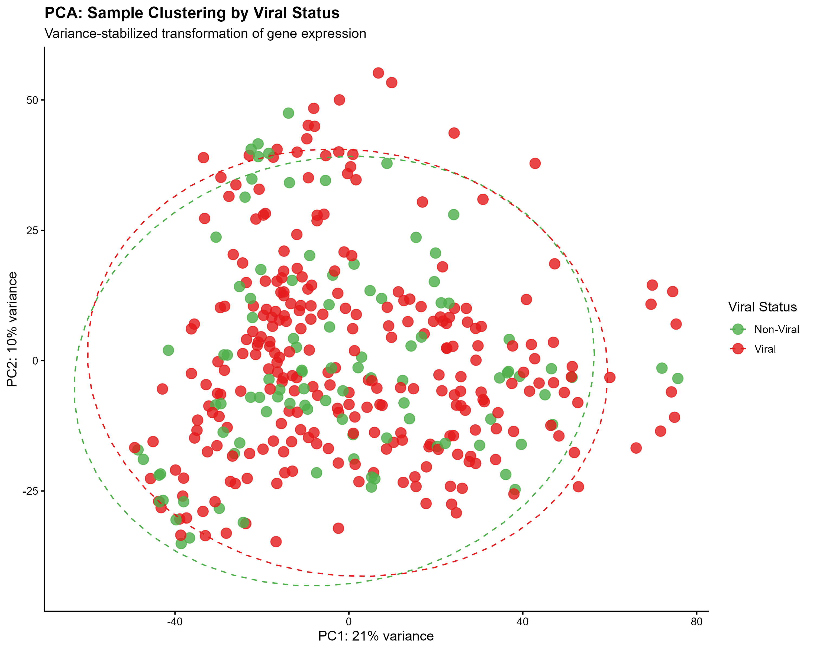
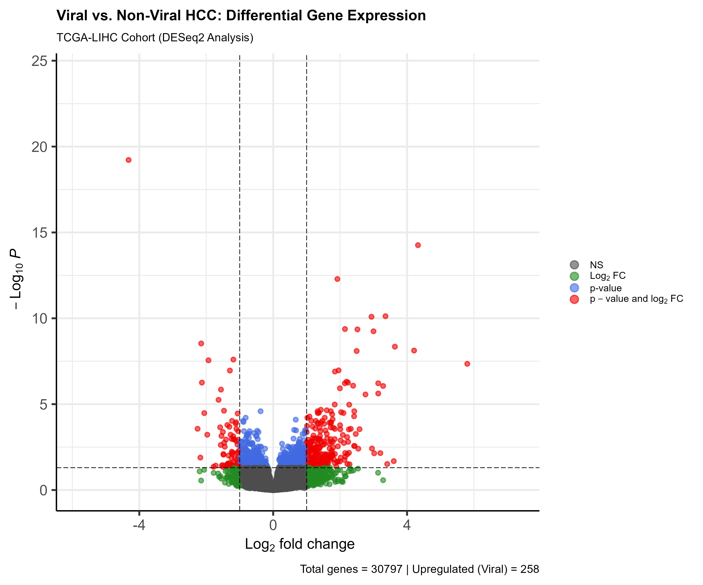
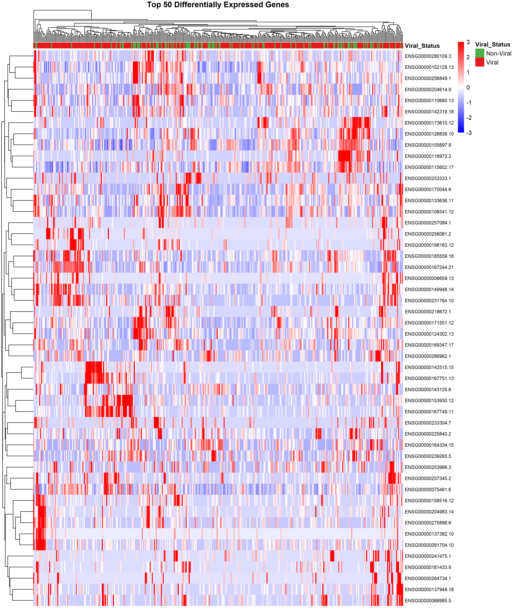
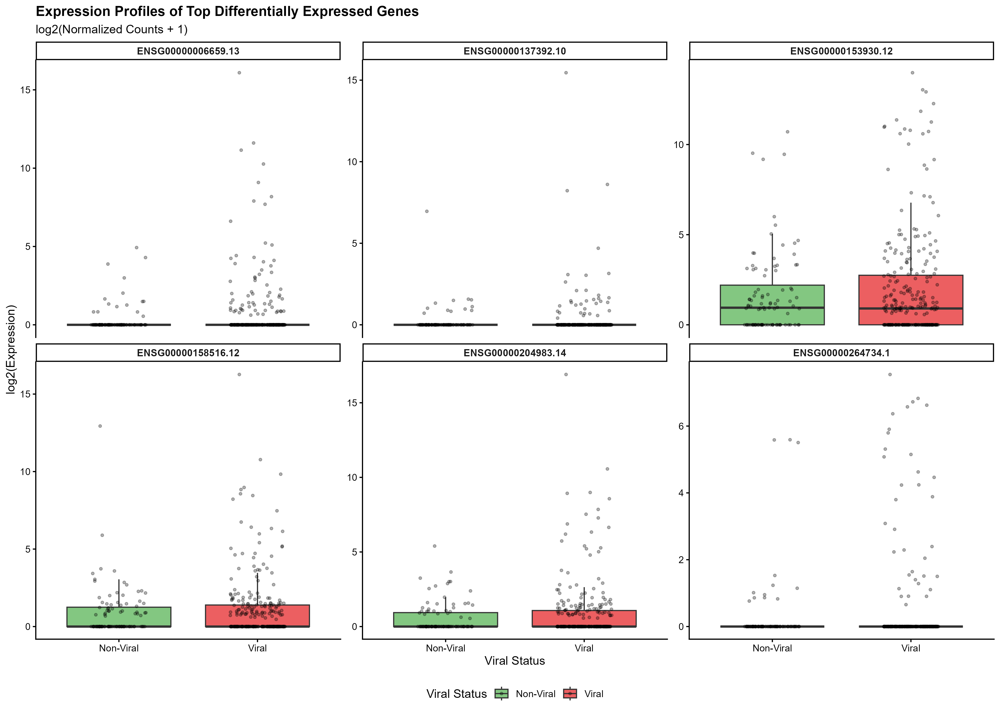
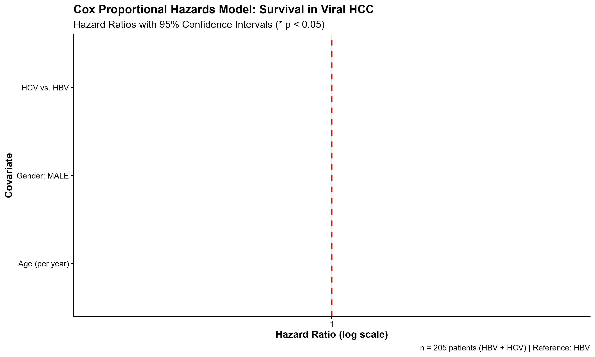
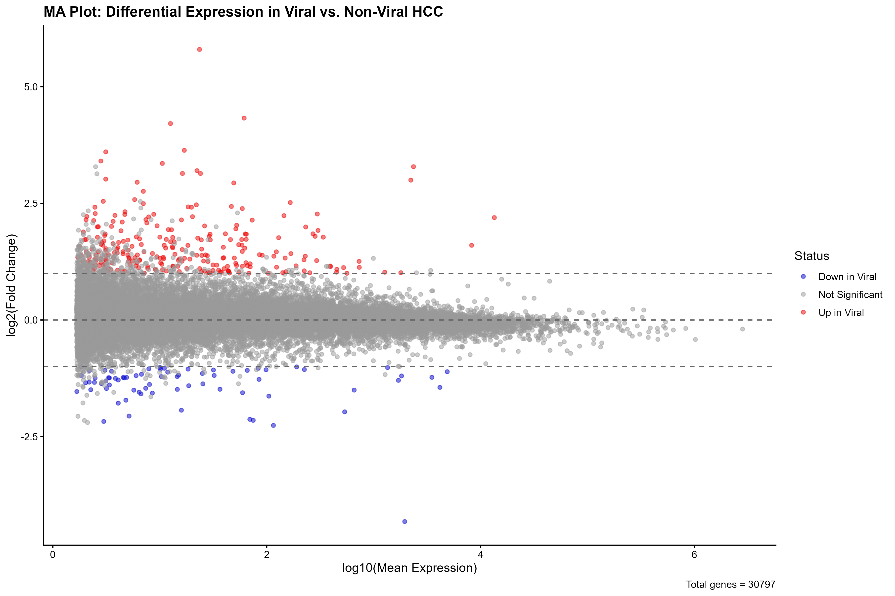

# TCGA Viral Etiology in Hepatocellular Carcinoma
## Overview

Comprehensive transcriptomic analysis comparing **viral** (HBV/HCV) versus **non-viral** hepatocellular carcinoma (HCC) using The Cancer Genome Atlas (TCGA-LIHC) dataset.

## Analysis Pipeline

1. **Data Loading & QC** - Patient ID standardization, viral status classification
2. **Differential Expression** - DESeq2 negative binomial modeling
3. **Pathway Enrichment** - KEGG & GO gene set enrichment analysis
4. **Survival Analysis** - Cox proportional hazards, Kaplan-Meier curves
5. **Visualizations** - Publication-quality figures

## Installation & Usage

### Prerequisites
- R 4.5+
- See `install_packages.R` for dependencies

### Quick Start
```r
# Install packages
source("install_packages.R")

# Run analysis
rmarkdown::render("TCGA_Viral_Etiology_Analysis_Enhanced.Rmd")
```

## Repository Structure

```
├── TCGA_Viral_Etiology_Analysis_Enhanced.Rmd  # Main analysis
├── install_packages.R                         # Setup
├── data/                                      # Input files
├── results/                                   # CSV outputs
└── figures/                                   # Visualizations
```

## Key Results Visualizations

### 1. PCA of Gene Expression


### 2. Volcano Plot: Viral vs Non-Viral


### 3. Top 50 Differentially Expressed Genes (Heatmap)


### 4. Top Genes Expression (Boxplots)


### 5. Survival Analysis (Cox Model)


### 6. MA Plot


**Data Source**: [TCGA-LIHC](https://portal.gdc.cancer.gov/)
